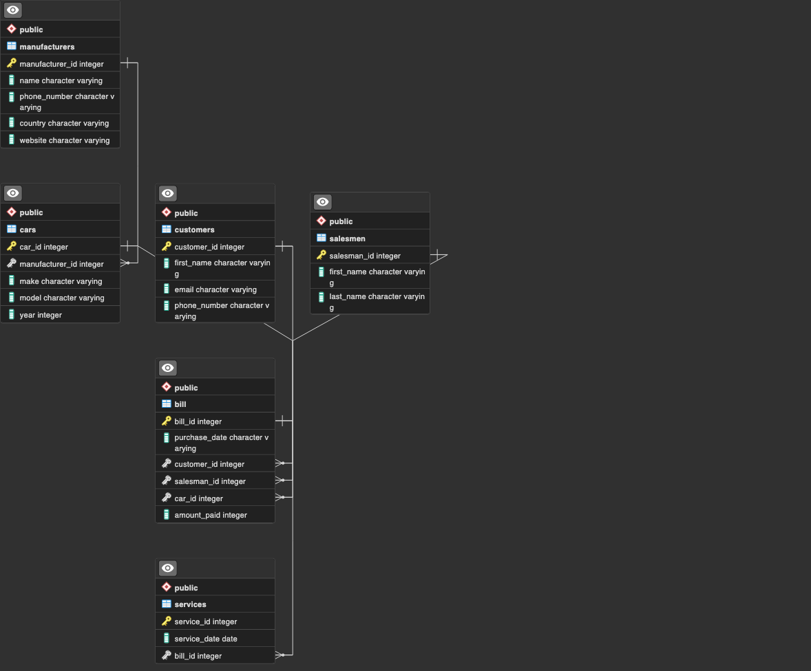
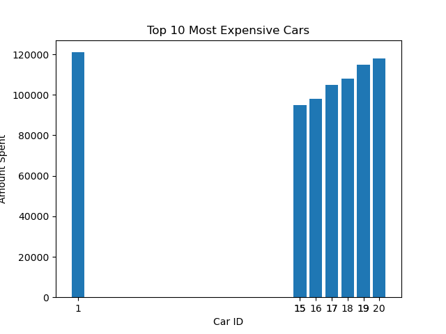
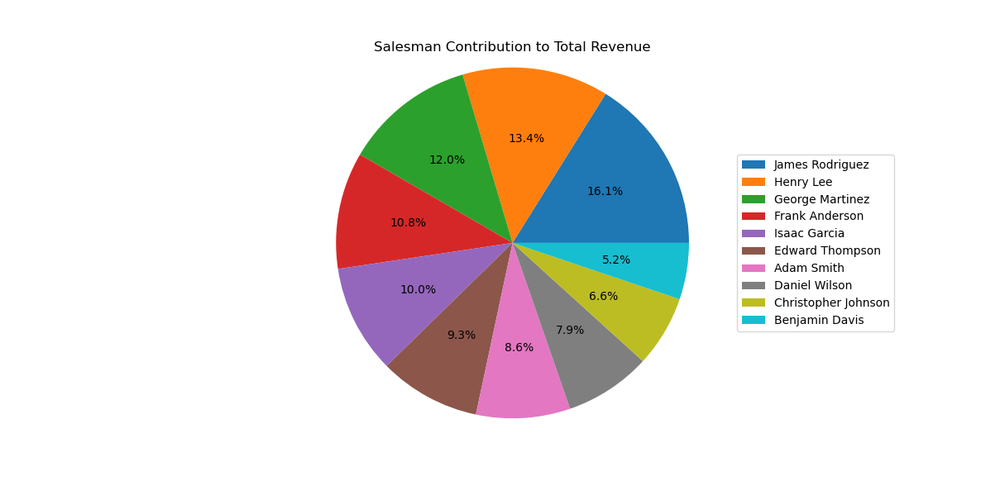

--- 
# Car dealership DataBase
 
 
This is a database about a car dealership that sells and services cars. It stores information about customers, bills, cars, manufacturers and salesmen who work in the dealership.
 
 

## [physical models](https://github.com/hrbaruri/DB_project/blob/branch-1/docs/physicalmodels.md) 

### Table `customers`:
stores info on customers. Each customer has an ID, first and last names, phone number and email.

 
 

### Table `bill`:
Stores information on bills paid by customer. It contains the bill id, the customer id of the related customer, the salesman id of the salesman in charge of the transcation, the amount paid, the car sold and the date of the transaction.

 
 

### Table `cars`:
Each car in this table has a car ID, a make, a model, manufacturer, and year in which it was made.

 
 

### Table `manufacturer`:
Each manufacturer has an ID, a name, phone number , country of origin and a website.
 
 

### Table `salesmen`:
This table only stores the salesman ID, and their first and last names.
 
 

### Table `service`:
The service Table stores information about the service ID, the bill_id of the bill that the customer paid for the service, and the date.
******
## Tasks
 

#### Task3 
DDL commands
- Making the [database.](https://github.com/hrbaruri/DB_project/blob/branch-1/sql_scripts/create_DB_ddl.sql) 
- DDL for [creating tables.](https://github.com/hrbaruri/DB_project/blob/branch-1/sql_scripts/task3_DB_create_ddl.sql)

#### Task 4
 Entering data into tables
- [Insert statements.](https://github.com/hrbaruri/DB_project/blob/branch-1/sql_scripts/task4_DB_insert_ddl.sql)

#### Task 5 
CRUD
- CRUD commands are [here](https://github.com/hrbaruri/DB_project/blob/branch-1/sql_scripts/task5_CRUD.sql)

#### Task 6 
- [SELECT queries](https://github.com/hrbaruri/DB_project/blob/branch-1/sql_scripts/task6_DB.sql)

#### Task 7
- [Tests](https://github.com/hrbaruri/DB_project/blob/branch-1/tests/task7_tests_for_task6.py) for task 6.

#### Task 8
Indexes for tables
- [Indexes](https://github.com/hrbaruri/DB_project/blob/branch-1/sql_scripts/task8_indexes.sql)

#### Task 9
Task about views
- Postgres [views](https://github.com/hrbaruri/DB_project/blob/branch-1/sql_scripts/task9_DB.sql)

#### Task 10
2 Stored function  
- [Stored functions](https://github.com/hrbaruri/DB_project/blob/branch-1/sql_scripts/task10_stored_function.sql)

#### Task 11
2 Triggers
- [Triggers](https://github.com/hrbaruri/DB_project/blob/branch-1/sql_scripts/task11_triggers.sql)

****
### Task 12 Analysis
<i> <b>P.S.</b>: These observation were made after inserting additional data from [bill_extra_inserts.sql](https://github.com/hrbaruri/DB_project/blob/branch-1/analysis/bill_extra_inserts.sql). Since otherwise there is too little data.</i>  
Using python, the following data about the most expensive cars and the contribution of salesmen have been made: 
- Top 10 most expensive cars (result from [analysis-1.py](https://github.com/hrbaruri/DB_project/blob/branch-1/analysis/analysis-1.py)):

 

- Contribution of each salesman to total revenue (result from [analysis-2.py](https://github.com/hrbaruri/DB_project/blob/branch-1/analysis/analysis-2.py)): 

